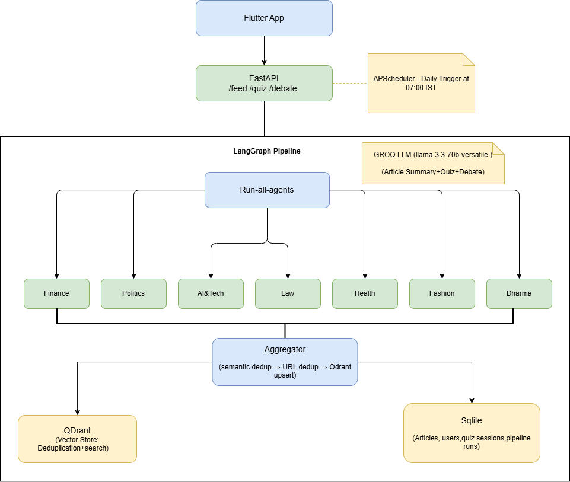

# Rudh Reads

An AI-powered daily reading app for educated Indian readers. Every morning at 7 AM IST, a LangGraph pipeline runs 7 domain agents in parallel — fetching, filtering, and summarising the day's most relevant news across Finance, Politics, AI & Tech, Law, Health, Fashion, and Dharma. This is a fully functional Flutter Mobile App in which the feed is surfaed with per-article quizzes and a grounded debate mode.


---

## What it does

**Daily feed** — Articles are fetched from Tavily Search and NewsAPI, scraped for full content via trafilatura, filtered for quality, deduplicated, summarised by Groq (Llama 3.3 70B), and stored. The pipeline runs automatically at 07:00 IST or can be triggered on demand from the app.

**Quiz** — For any article, the app generates 3 MCQ comprehension questions from the summary and scores the user's answers with explanations. The aim of this feature is to test the user's retention capacity. This will prevent a mindless scroll and promotes more attention to the content.

**Debate** — This feature is an agent in itself which is capable of taking a stand against the user's POV and can push back where warranted, enhancing interactions thereby increasing the time spent on the application.


---

## Architecture/Flow Diagram




## Tech Stack

| Layer | Technology |
|---|---|
| Backend | FastAPI, Python 3.11 |
| Pipeline | LangGraph, APScheduler |
| LLM | Groq — Llama 3.3 70B Versatile |
| Content Fetching | Tavily Search API, NewsAPI, trafilatura |
| Vector Store | Qdrant (local path or Qdrant Cloud) |
| Relational DB | SQLite (dev) / PostgreSQL (Railway) |
| Embeddings | `all-MiniLM-L6-v2` via sentence-transformers |
| Frontend | Flutter, Provider |
| Deployment | Railway (nixpacks) |

---

## Key Design Decisions

**Why two databases?** SQLite owns structured relational data (users, reading history, quiz sessions, pipeline run status). Qdrant owns vector embeddings for semantic deduplication — catching paraphrased or syndicated duplicates that URL matching misses. Each store does what it's best at.

**Why Groq over OpenAI?** Speed and cost on the free tier. The pipeline calls the LLM for every article; latency compounds across 7 agents running daily. Groq's inference hardware keeps per-article summarisation fast enough to complete the full pipeline in a reasonable window.

**Why LangGraph?** Clear node boundaries (`run_all_agents` → `aggregator`), typed state with automatic list merging via `operator.add` when parallel branches complete, and a well-defined entry point for testing each node independently.

**Embeddings on Railway** — `sentence-transformers` is disabled on the deployed Railway instance to stay within memory limits (~512 MB). Deduplication falls back to URL-exact matching in that environment. Local dev uses the full semantic dedup stack.

**Concurrent Groq calls** are capped at 2 via `threading.Semaphore(2)`. With 7 agents running in parallel, each making 3–5 LLM calls, uncapped concurrency hits the API rate limit on every pipeline run.

More: [DECISIONS_AND_TRADEOFFS.md](./DECISIONS_AND_TRADEOFFS.md)

---

## Local Setup

**Prerequisites:** Python 3.11+, Flutter 3.x, API keys for Groq, Tavily, and NewsAPI.

```bash
# 1. Clone and set up backend
git clone https://github.com/ani-90/Knowledge-News-App.git
cd Knowledge-News-App

cp .env.example .env
# Fill in GROQ_API_KEY, TAVILY_API_KEY, NEWSAPI_KEY

pip install -r requirements.txt
python run.py
# Server starts at http://localhost:8000
```

```bash
# 2. Run the Flutter app
cd frontend
flutter pub get
flutter run
# Point api_client.dart to http://localhost:8000
```

**Trigger the pipeline manually:**
```bash
curl -X POST http://localhost:8000/api/feed/refresh \
  -H "Content-Type: application/json" \
  -d '{"user_id": 1}'
```

**Check pipeline status:**
```bash
curl http://localhost:8000/api/feed/status/<run_id>
```

---

## Domains

| Domain | What it covers |
|---|---|
| Finance | RBI, SEBI, ITR, EPF, markets |
| Politics | India domestic, geopolitics, global |
| AI & Tech | LLM releases, engineering, AI tools |
| Law | Supreme Court, consumer rights, cyber law |
| Health | Evidence-based fitness and nutrition |
| Fashion | Indian context — styling and trends |
| Dharma | Vedanta, epics, mantras, festival meaning |

---

## API Reference

| Method | Endpoint | Description |
|---|---|---|
| `POST` | `/api/feed/refresh` | Trigger pipeline run (2-hour cooldown) |
| `GET` | `/api/feed/status/{run_id}` | Poll pipeline run status |
| `GET` | `/api/feed?domain=finance` | Get articles, optionally filtered by domain |
| `GET` | `/api/feed/{article_id}` | Article detail with full content |
| `POST` | `/api/feed/{article_id}/summarize` | Generate/fetch summary |
| `POST` | `/api/feed/{article_id}/read` | Mark article read |
| `POST` | `/api/quiz/generate` | Generate 3 MCQs from article summary |
| `POST` | `/api/quiz/submit` | Submit answers, get score + breakdown |
| `POST` | `/api/debate/message` | Send debate message, get grounded reply |
| `POST` | `/api/user` | Create user |
| `GET` | `/api/user/stats` | Reading history + quiz scores by domain |

---

## Deployment

Deployed on Railway via nixpacks. Set the following environment variables in Railway:

```
GROQ_API_KEY
TAVILY_API_KEY
NEWSAPI_KEY
DATABASE_URL          # Railway PostgreSQL URL (auto-set)
QDRANT_URL            # Qdrant Cloud cluster URL (optional)
QDRANT_API_KEY        # Qdrant Cloud key (optional)
SCHEDULE_HOUR=1       # UTC hour for daily refresh (1 = 07:00 IST)
SCHEDULE_MINUTE=30
```

---

## Known Limitations

- Single-user architecture — the scheduler runs for `user_id=1`. Multi-user scheduling would require per-user cron jobs or a queue.
- No auth layer — user creation is open; the debate and quiz endpoints accept any `user_id`.
- Embeddings disabled on Railway — semantic dedup falls back to URL matching in the deployed environment.
- No test suite — unit tests for the pipeline nodes and aggregator are the next priority.
